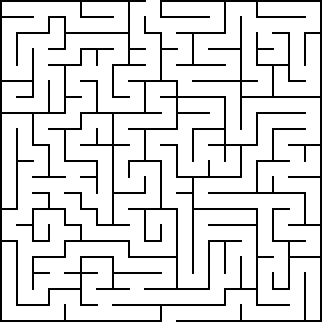
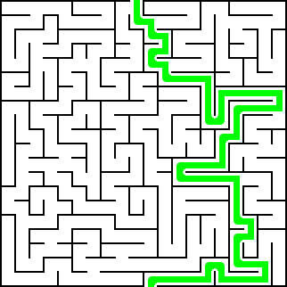

# Batch Maze Solver

A batch maze solver implementing Task Offloading in Python using *OpenCV*, *Kubernetes* and *Azure*. 

**Task Offloading** is the transfer of resource intensive computational tasks to an external platform, such as a cluster, grid, or a cloud. In order to achieve a certain throughput in a system with limited resources, some computationally heavy tasks can be delegated to an external platform. In this project for demonstration purposes, that task is to solve a maze using image processing.

| Input  | Output  |
|---|---|
|   |  |

## How does it work?

1. The client application runs on a IOT device having limited computational resources.
2. If the number of images to be processed is small and computationally feasible, then the complete task runs on the device itself.
3. Otherwise it is delegated to the maze solver running in a **Kubernetes** cluster on **Azure**. The maze is solved and uploaded to the *Azure Blob Storage*.
4. The Kubernetes cluster speeds up the computation by running multiple copies of the maze solver using a `Horizontal Pod Autoscaler`(HPA).
5. The client then pulls the solution images from the *Azure Blob Storage*.

## Scope for Improvements

1. The HPA currently autoscales according to the CPU usage. Look into alternate metrics that can be used. Length of the *Azure Queue* could be a better metric.
2. Azure secret keys have been stored in the source code. It should be taken a environment variables. Although the keys are no longer valid now so not so important.
